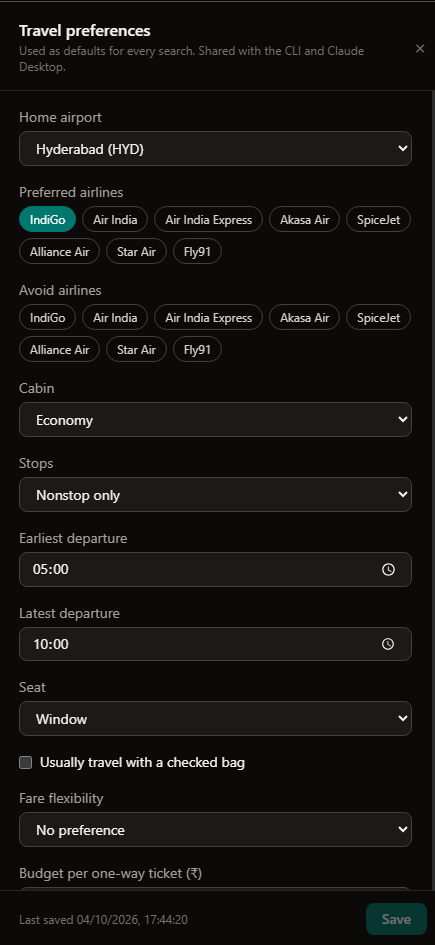
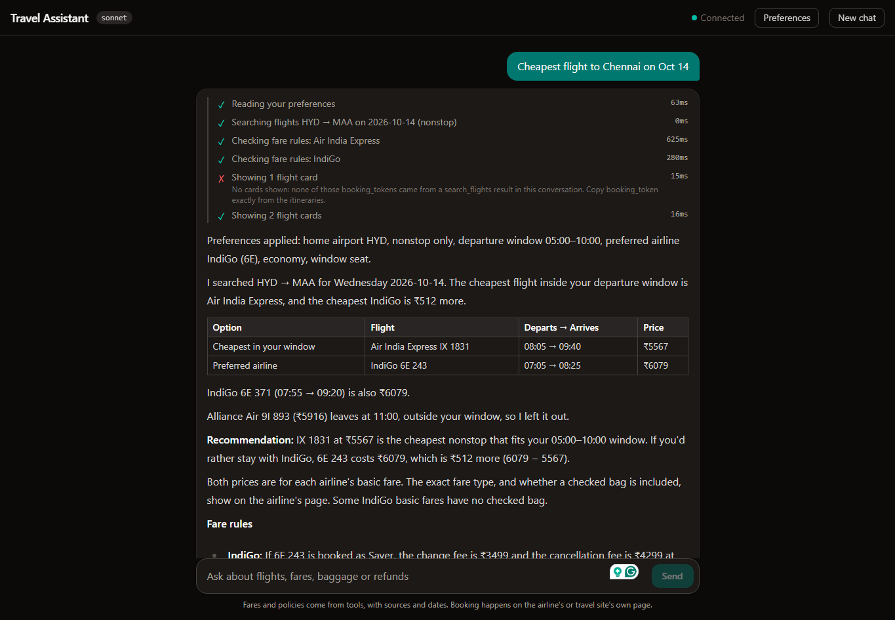
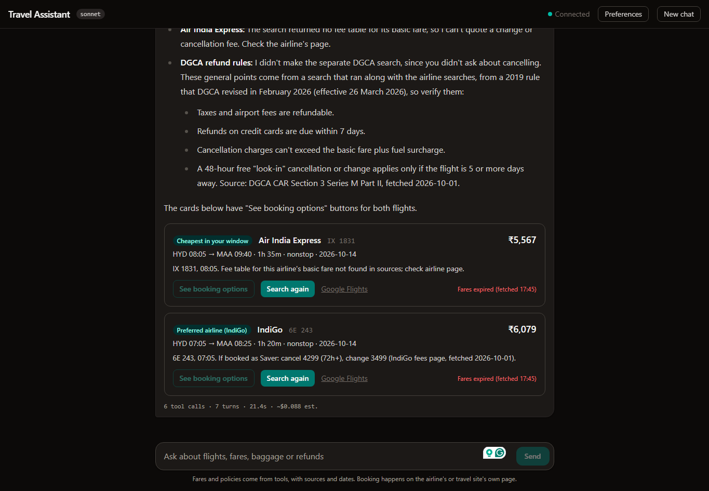
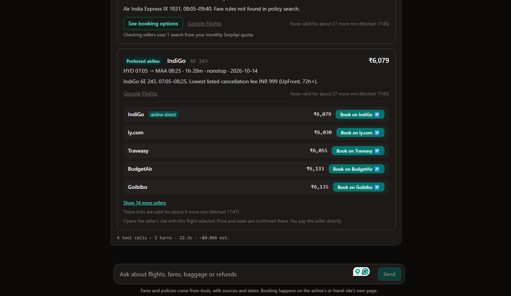
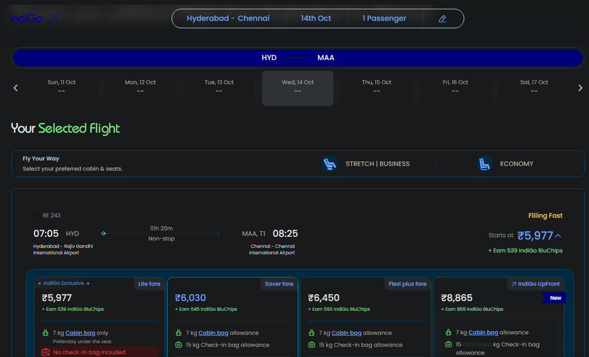

# Travel Assistant

A personal AI assistant for Indian domestic flights. It searches live fares, answers fare-rule and
passenger-rights questions with citations, remembers your preferences, and is measured by an eval
suite. It's built with **MCP**, **RAG**, the **Claude Agent SDK** and deterministic **evals**.

📚 **Docs:** [docs/README.md](docs/README.md): architecture, design decisions, setup, operations.

## See it in action

A real run in the web UI: "Cheapest flight to Chennai on Oct 15", with saved preferences
(home HYD, nonstop, 05:00–10:00, prefers IndiGo).

**1. Preferences: pick airports and airlines by name; every search uses them**



**2. Live tool activity, preferences applied, shortlist and fare rules with sources**



The "Claude login" badge shows what the agent runs on: your Claude login when one is found on
your computer, otherwise an Anthropic API key you enter ([details](docs/ui.md#claude-access-login-or-api-key)).
Fees are quoted for the basic fare type ("if booked as Saver"), never a pricier one.

**3. Flight cards filled from the real search result, with fare expiry**



**4. "See booking options": airline direct first, then travel sites, with link expiry**



**5. "Book on IndiGo" opens the airline's page with 6E 243 already selected**



Booking and payment happen on the seller's site. The assistant never books or pays.

## Components

| Folder | What it does | Backed by |
|---|---|---|
| [`mcp-server/`](mcp-server/README.md) | 9 MCP tools: flight search, booking options, day-of-travel status, policy search, preferences, quota usage | SerpApi (Google Flights) · AirLabs · SQLite |
| [`rag/`](rag/README.md) | Official IndiGo, Air India, Akasa and DGCA pages → hybrid retrieval with citations and freshness checks | SQLite FTS5 + local bge-small embeddings (RRF) |
| [`agent/`](agent/README.md) | Trip planner: preferences → search → fare rules and DGCA rights → cited recommendation, with guardrails enforced in code | Claude Agent SDK |
| [`ui/`](docs/ui.md) | Browser chat with live tool activity, flight cards with **"Book on IndiGo ↗"** redirects and expiry countdowns, and a preferences panel | React + Vite + Tailwind, FastAPI |
| [`evals/`](evals/README.md) | 22 cases scoring tool use, arguments, citations, and whether every ₹ amount came from a tool | Real agent runs + deterministic checks |

## Quick start (Windows)

```powershell
copy .env.example .env      # add SERPAPI_KEY and AIRLABS_API_KEY
cd mcp-server; python -m uv sync --extra dev; python -m uv run travel-rag ingest
cd ..\agent;   python -m uv sync --extra dev
python -m uv run travel-agent ask "Cheapest nonstop HYD to MAA next Friday, and the cancellation fee?" -v
python -m uv run travel-eval --model haiku
cd ..\ui; npm install; npm run build; cd ..\agent; python -m uv run travel-agent web --open
```

Full setup, including saving the bot-blocked airline pages and connecting Claude Desktop, is in
[docs/setup.md](docs/setup.md).

## Status

- [x] MCP server: search (SerpApi / Google Flights) and day-of-travel status (AirLabs)
- [x] RAG: airline and DGCA policy search with citations (hybrid BM25 + vectors)
- [x] Saved travel preferences (read/update via MCP, approval-gated writes)
- [x] Agent: Claude Agent SDK planner with guardrails and run traces
- [x] Evals: 22 deterministic cases including ₹ grounding. **Latest: sonnet 18/18, haiku 15/18** ([details](evals/baselines/README.md))
- [x] React chat UI with live tool activity
- [x] Flight cards that redirect to the seller's booking page; preferences panel
- [x] Web UI runs on your Claude login when it finds one, otherwise on your own Anthropic API key
- [ ] Fix known gaps found by evals ([roadmap](docs/roadmap.md))
- [x] Booking handled by redirecting to the airline or travel site (no bookable flight API is available to individual developers in India)
