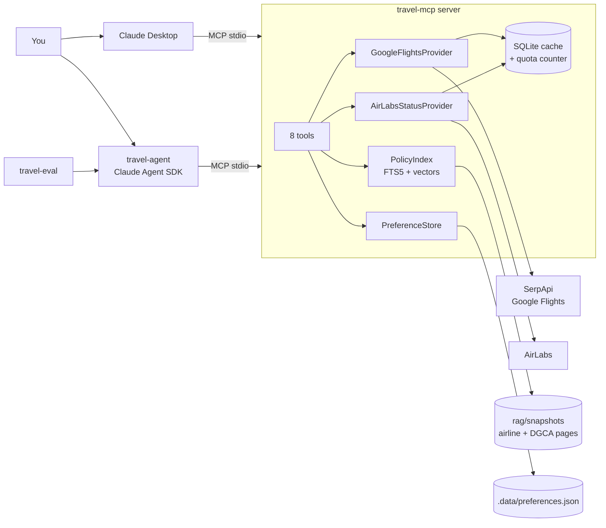

# Architecture

## Components

| Folder | Package | Role |
|---|---|---|
| `mcp-server/` | `travel_mcp` | The MCP server. It owns all external I/O: flight APIs, the policy index and preferences. It's usable on its own from Claude Desktop |
| `rag/` | (data) | `sources.yaml` lists which official pages to index. `manual/` and `snapshots/` (both gitignored) hold the captured copies |
| `agent/` | `travel_agent` | Trip-planning agent on the Claude Agent SDK. It reaches the server **only over MCP**, the same interface Claude Desktop uses |
| `agent/…/evals` + `evals/` | `travel_agent.evals` | Runs fixed cases through the real agent and scores the traces |
| `.data/` | (gitignored) | Runtime state: API cache and quota counts, policy index, embedding model, preferences, agent run traces |

## Boundaries and why

- **The MCP protocol is the only seam between the agent and the server.** The agent never imports
  server code, so whatever the agent can do, Claude Desktop can do too, and either side can be
  replaced independently.
- **Providers sit behind interfaces** (`FlightSearchProvider`, `FlightStatusProvider`). SerpApi
  replaced Duffel/Amadeus without any tool changes, and Travelpayouts could slot in the same way.
- **All HTTP goes through one helper** (`CachedHTTP`: cache → budget check → call → count →
  cache), so quota protection can't be skipped by accident.
- **Guardrails are enforced in code**, both in the server (validation, quotas) and in the agent
  (PreToolUse hook), not only in prompts.

## A trip request, end to end

1. `travel-agent ask "Cheapest nonstop HYD to MAA next Friday, cancel cost?"`
2. The agent calls `get_travel_preferences` and applies the defaults.
3. `search_flights` → validation → cache miss → budget check → SerpApi → parsed into compact `Itinerary` models.
4. `search_policies` (IndiGo) and `search_policies` (DGCA) → hybrid search over the snapshots → cited passages with fetch dates.
5. The agent writes a recommendation that quotes only tool outputs. The trace is saved to `.data/agent_runs/`.
6. The evals replay cases like this and check the tool calls, arguments, citations, and that every ₹ amount is grounded in a tool result.
